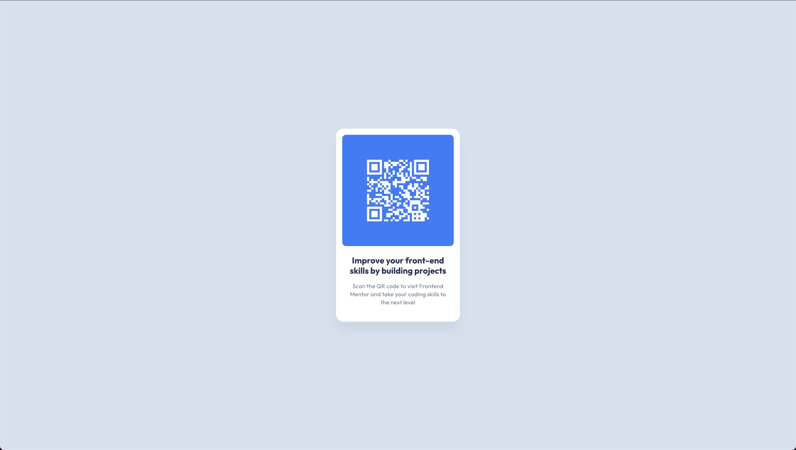

# Frontend Mentor - QR code component solution

This is a solution to the [QR code component challenge on Frontend Mentor](https://www.frontendmentor.io/challenges/qr-code-component-iux_sIO_H). This project demonstrates modern frontend development best practices, focusing on accessibility, performance, and maintainable code.

## Table of contents

- [Overview](#overview)
  - [Screenshot](#screenshot)
  - [Links](#links)
- [My process](#my-process)
  - [Built with](#built-with)
  - [What I learned](#what-i-learned)
  - [Continued development](#continued-development)
  - [Useful resources](#useful-resources)
- [Author](#author)

## Overview

### Screenshot



### Links

- Solution URL: [GitHub Repository](https://github.com/shoyo-22/qr-code-component)
- Live Site URL: [Live Demo](https://qr-code-component-three-peach.vercel.app/)

## My process

### Built with

- Semantic HTML5 markup
- CSS custom properties
- Flexbox
- Mobile-first workflow
- Performance optimizations
- Accessibility best practices

### What I learned

#### Semantic HTML Structure
```html
<main role="main">
  <article class="card" role="article" aria-labelledby="card-title">
    <figure class="card__qr-container">
      
    </figure>
  </article>
</main>
```

#### CSS Architecture with BEM and Custom Properties
```css
:root {
  /* Colors */
  --white: #fff;
  --blue-500: #3685ff;
  --blue-600: #2c7dfa;
  --slate-300: #d5e1ef;
  --slate-500: #68778d;
  --slate-900: #1f314f;

  /* Spacing */
  --spacing-200: 16px;
  --spacing-300: 24px;
  --spacing-500: 40px;
}

.card {
  max-width: 320px;
  border-radius: var(--border-radius-lg);
  background-color: var(--white);
  box-shadow: var(--box-shadow);
  transition: transform var(--transition-duration) ease-in-out,
              box-shadow var(--transition-duration) ease-in-out;
}
```

#### Performance Optimizations
- Implemented resource preloading for critical assets
- Optimized image loading with `loading="eager"` and `decoding="async"`
- Used CSS custom properties for efficient theme management
- Implemented reduced motion support for accessibility

#### Accessibility Features
- Proper ARIA roles and labels
- Semantic HTML structure
- Reduced motion support
- High contrast color scheme
- Focus management

### Continued development

Areas for future improvement and focus:

1. **Performance Metrics**
   - Implement Core Web Vitals monitoring
   - Add performance budgets
   - Optimize critical rendering path

2. **Testing**
   - Add automated accessibility testing
   - Implement cross-browser testing
   - Add visual regression testing

3. **Documentation**
   - Add component API documentation
   - Create contribution guidelines
   - Add automated documentation generation

4. **Development Experience**
   - Add development environment setup
   - Implement linting and formatting
   - Add pre-commit hooks

### Useful resources

- [MDN Web Docs - Accessibility](https://developer.mozilla.org/en-US/docs/Web/Accessibility) - Comprehensive guide to web accessibility
- [CSS Custom Properties](https://developer.mozilla.org/en-US/docs/Web/CSS/Using_CSS_custom_properties) - Deep dive into CSS variables
- [BEM Methodology](https://en.bem.info/methodology/) - Official BEM documentation
- [Web Performance](https://web.dev/performance/) - Google's performance optimization guide
- [ARIA Authoring Practices](https://www.w3.org/WAI/ARIA/apg/) - W3C's ARIA best practices

## Author

- Frontend Mentor - [@yourusername](https://www.frontendmentor.io/profile/shoyo-22)
- GitHub - [@shoyo-22](https://github.com/shoyo-22)